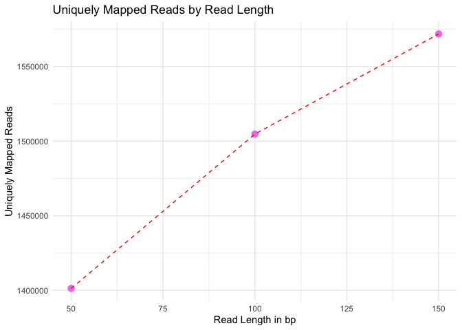
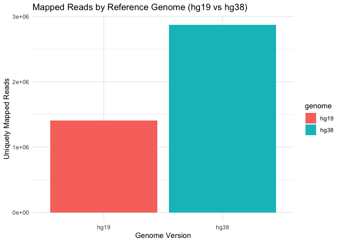
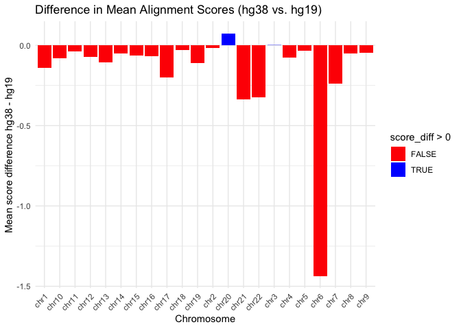
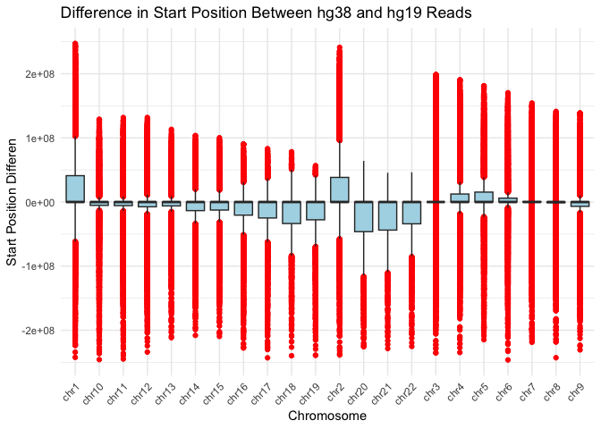
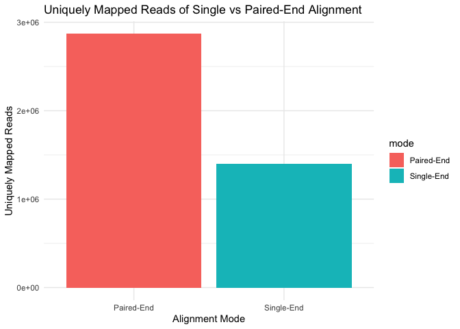

BMEG 424/524 Assignment 2
================
Kyle Ngo (57821324)

- [BMEG 424 Assignment 2:
  Mappability](#bmeg-424-assignment-2-mappability)
  - [Introduction:](#introduction)
    - [Software and Tools:](#software-and-tools)
    - [Data:](#data)
    - [Goals and Objectives:](#goals-and-objectives)
    - [Other notes:](#other-notes)
    - [Submission:](#submission)
  - [Experiment and Analysis:](#experiment-and-analysis)
    - [1. Creating a modular mapping pipeline (7
      pts)](#1-creating-a-modular-mapping-pipeline-7-pts)
    - [a. Building the basic rules](#a-building-the-basic-rules)
    - [b. Read length](#b-read-length)
    - [c. Reference genome](#c-reference-genome)
    - [d. Paired vs. Single End
      Alignment](#d-paired-vs-single-end-alignment)
    - [2. Testing factors affecting mappability (4.5
      pts)](#2-testing-factors-affecting-mappability-45-pts)
    - [3. Analyzing the results (18
      pts)](#3-analyzing-the-results-18-pts)
      - [a. Effect of read length on
        mappability](#a-effect-of-read-length-on-mappability)
      - [b. Effect of reference genome on
        mappability](#b-effect-of-reference-genome-on-mappability)
      - [c. Effect of alignment mode on
        mappability](#c-effect-of-alignment-mode-on-mappability)
  - [Discussion (8 pts):](#discussion-8-pts)
- [Contributions](#contributions)

# BMEG 424 Assignment 2: Mappability

## Introduction:

### Software and Tools:

In this assignment we will be using the following tools: -
[bowtie2](http://bowtie-bio.sourceforge.net/bowtie2/index.shtml) -
[samtools](http://www.htslib.org/doc/samtools.html) -
[sambamba](http://lomereiter.github.io/sambamba/docs/sambamba-view.html) -
[trimmomatic](http://www.usadellab.org/cms/uploads/supplementary/Trimmomatic/TrimmomaticManual_V0.32.pdf) -
[liftover](https://genome.ucsc.edu/cgi-bin/hgLiftOver) -
[bedtools](https://bedtools.readthedocs.io/en/latest/) -
[conda](https://conda.io/docs/) -
[snakemake](https://snakemake.readthedocs.io/en/stable/)

### Data:

Your data is located in the following directory: `/projects/bmeg/A2/`.
You have been provided with 2 fastq files (forward and reverse reads)
named `H3K27me3_iPSC_SRA60_subset_<1/2>.fastq.gz` These files contain a
subset of the reads from a H3K27me3 ChIP-seq experiment performed on
human iPSCs. Don’t worry about what ChIP-seq experiments are or what
they measure, that will be the topic of next weeks assignment.

### Goals and Objectives:

In this assignment you will be using the concepts you learned in class
to investigate the effect of various factors on mappability. You will be
using the snakemake workflow management system to create a modular
mapping pipeline. You will then use this pipeline to test the effect of
read length, reference genome, and alignment mode on mappability.
Finally, you will analyze the results of your experiments and discuss
your findings.

### Other notes:

- As always you must cite any sources you use in your assignment (class
  slides are exempted). This includes any code you use from
  StackOverflow, ChatGPT, Github, etc. Failure to cite your sources will
  result in (at least) a zero on the assignment.
- You are going to be using another snakemake pipeline, please ensure
  you are limiting snakemake to a single core and less than 4GB of
  memory. You can do this by adding the following to your snakemake
  command: `--cores 1 --resources mem_mb=4000`
- You will be reusing several of the same tools between A1 and A2. To
  save time you can clone your A1 conda environment
  (<https://conda.io/projects/conda/en/latest/user-guide/tasks/manage-environments.html#cloning-an-environment>)
  and install the additional tools you need for this assignment into
  your A2 env. Check if you have the tools installed by using
  `conda list` or simply typing the tool in the command line after your
  environment is activated.
- Remember to gzip any large files you produce working and delete them
  when you are done with the assignment. If you take up too much space
  in your home directory you will not be able to save your work and will
  prevent others from doing the same, you will also make your TAs very
  unhappy :(

### Submission:

Submit your assignment as a knitted RMarkdown document. You will push
your knitted RMarkdown document to your github repository (one for each
group). You will then submit the link to your repo, along with the names
and student numbers of all students who worked on the assignment to the
assignment 2 page on Canvas. Your assignment should be submitted, and
your last commit should be made, before 11:59pm on the day of the
deadline. Late assignments will will be deducted 10% per day late.
Assignments will not be accepted after 3 days past the deadline.

## Experiment and Analysis:

### 1. Creating a modular mapping pipeline (7 pts)

**A snakemake file is provided in Part 2. Simply update the shell
portions which you will complete below.** If you are stuck on running
snakemake, simply execute the commands individually in the terminal
manually and proceed to perform your analysis in Part 3 and Discussion
questions.

### a. Building the basic rules

Our mapping rule will be similar to the rule you used in the last
assignment for mapping reads to the genome using bowtie2. For your
convenience, a correct single-ended mapping rule has been provided
below. Reference it as necessary in the rules you write.

``` r
rule align:
    input:
        fastq = "path/to/data/{sample}.fastq.gz",
    output:
        sam = "aligned/{sample}.sam"
    shell:
        "bowtie2 -x /projects/bmeg/indexes/hg38/hg38_bowtie2_index "
        "-U {input.fastq} -S {output.sam}"
```

We’ll also have to convert the aligned sam files to bam format (binary
sam). As before you can do this using samtools. You can install samtools
into your A2 conda environment with
`conda install -c bioconda samtools`. The samtools manual can be found
[here](http://www.htslib.org/doc/samtools.html). For your convenience, a
correct conversion rule has been provided below:

``` r
rule sam_to_bam:
    input:
        sam = "aligned/{sample}.sam"
    output: 
        bam = "aligned/{sample}.bam"
    shell:
        "samtools view -h -S -b -o {output.bam} {input.sam}"
```

We will also need a rule that will count the number of uniquely mapped
reads in our sam file generated by bowtie2. In order to do this we will
use a useful multipart tool called sambamba. Sambamba is a tool for
working with sam and bam files. You can install sambamba into your A2
conda environment with `conda install -c bioconda sambamba`. The
sambamba manual can be found
[here](http://lomereiter.github.io/sambamba/docs/sambamba-view.html).

This code was written with the help of ChatGPT, which helped me fix the
syntax and brainstormed
[Link](https://chatgpt.com/share/6799ae1b-e2f0-8005-9a1c-4b24d4df4738)

``` r
#?# 1. Fill in (where it says <complete command>) the following rule which will count the number of uniquely mapped reads in a sam file. (0.5 pts)

rule count_unique_reads:
    input:
        bam = "aligned/{sample}_CROP{length}_{genome}_{mode}.bam"
    output:
        counts = "counts/{sample}_CROP{length}_{genome}_{mode}_nReads.txt"
    shell:
        "sambamba view -F"
        "\"[XS] == null and not unmapped and <complete command>\" {input.bam} > {output.counts}"
```

### b. Read length

The first factor affecting mappability which we will test in this
assignment is read length. In order to test this variable we will have
to trim our reads to different lengths before aligning them. We will use
the trimmomatic tool to trim our reads. You can install trimmmomatic
into your A2 conda environment with
`conda install -c bioconda trimmomatic`.

We will want to use the SE option for single end reads. The trimmomatic
manual can be found
[here](http://www.usadellab.org/cms/uploads/supplementary/Trimmomatic/TrimmomaticManual_V0.32.pdf).

This code was written with the help of ChatGPT, which helped me fix the
syntax and brainstormed
[Link](https://chatgpt.com/share/6799ae1b-e2f0-8005-9a1c-4b24d4df4738)

``` r
#?# 2. Fill in the rule (where it says <complete command>) such that you can dynamically trim reads to different lengths BEFORE mapping. (1 pts)

rule trim_reads_single:
    input:
        read_1 = "/projects/bmeg/A2/{sample}_1.fastq.gz",
    output:
        read_1 = "trimmed/{sample}_CROP{length}_1.fastq.gz",
    shell:
        """
        trimmomatic SE -phred33 {input.read_1} {output.read_1} CROP:#fill in the number of the trimming length
        """

rule trim_reads_paired:
    input:
        read_1 = "/projects/bmeg/A2/{sample}_1.fastq.gz",
        read_2 = "/projects/bmeg/A2/{sample}_2.fastq.gz"
    output:
        read_1 = "trimmed/{sample}_CROP{length}_1.fastq.gz",
        read_2 = "trimmed/{sample}_CROP{length}_2.fastq.gz"
    shell:  # simply use the trim reads commands twice
        """
        trimmomatic SE -phred33 {input.read_1} {output.read_1} CROP:#fill in the number of the trimming length
        trimmomatic SE -phred33 {input.read_2} {output.read_2} CROP:#fill in the number of the trimming length
        """
```

### c. Reference genome

Next we will see if mapping to different reference genomes affects
mappability. We will use both the hg19 and hg38 reference genomes. Both
genomes are available, indexed, at
`/projects/bmeg/genomes/<genome>/indexes/`

To compare reads mapped to different genomes we will need to use the
ucsc-liftover tool to convert the hg19 coordinates to hg38 coordinates.
You can install the liftover tool into your A2 conda environment with
`conda install ucsc-liftover`. You will also need to use
`/projects/bmeg/A2/hg19ToHg38.over.chain.gz` for conversion of hg19 to
hg38 coordinates.

This code was written with the help of ChatGPT, which helped me fix the
syntax and brainstormed
[Link](https://chatgpt.com/share/6799ae1b-e2f0-8005-9a1c-4b24d4df4738)

``` r
#?# 3. Complete the following rules' shell portion to dynamically map reads to different reference genomes. All resulting alignments should have hg38 coordinates irrespective of which genome was used. (1 pts)

rule align_single: 
    input:
        fastq1 = "trimmed/{sample}_CROP{length}_1.fastq.gz",
    output:
        sam = "aligned/{sample}_CROP{length}_{genome}_{mode}.sam"
    params:
        genome = config["genome"]
    shell:
        """
        if [ {params.genome} == "hg19" ]; then
            "bowtie2 -x /projects/bmeg/indexes/hg19/hg19_bowtie2_index "
            "-U {input.fastq} -S {output.sam}"
        elif [ {params.genome} == "hg38" ]; then
            "bowtie2 -x /projects/bmeg/indexes/hg38/hg38_bowtie2_index "
            "-U {input.fastq} -S {output.sam}"
        else
            echo "Invalid genome"
        fi
        """

rule bam_to_bed:
    input:
        bam = "aligned/{sample}_CROP{length}_{genome}_{mode}.bam"
    output:
        bed = "bed/{sample}_CROP{length}_{genome}_{mode}.bed"
    shell:
        "bedtools bamtobed -i {input.bam} > {output.bed}"

rule liftover:
    input:
        bed = "bed/{sample}_CROP{length}_{genome}_{mode}.bed", 
        chain = "/projects/bmeg/A2/hg19ToHg38.over.chain.gz"
    output:
        bed = "bed/{sample}_CROP{length}_{genome}_{mode}_lifted_hg38.bed",
        unlifted = "bed/{sample}_CROP{length}_{genome}_{mode}_unlifted.bed",
        confirmation = "aligned/lifted_over_{sample}_CROP{length}_{genome}_{mode}.done"
    params:
        genome = config["genome"]
    shell:
        """
        if [ {params.genome} == "hg19" ]; then
            liftOver {input.bed} {input.chain} {output.bed} {output.unlifted};
            touch {output.confirmation}
        elif [ {params.genome} == "hg38" ]; then
            echo "No need to lift over"
        else
            echo "Invalid mode"
        fi
        """
```

### d. Paired vs. Single End Alignment

The files you have been using so far have been single end reads.
However, paired end reads are also commonly used in sequencing. In
paired end sequencing, the same DNA fragment is sequenced from both
ends. This allows us to get information about the distance between the
two ends of the fragment. This information can be used to improve the
accuracy of the alignment.

“bowtie2 -x /projects/bmeg/indexes/hg38/hg38_bowtie2_index” “-U
{input.fastq} -S {output.sam}”

``` r
#?# 4. Update the rule from Part a. to do paired-end alignment. (1 pts)

rule align_paired:
    input:
        fastq1 = "trimmed/{sample}_CROP{length}_1.fastq.gz",
        fastq2 = "trimmed/{sample}_CROP{length}_2.fastq.gz",
    output:
        sam = "aligned/{sample}_CROP{length}_{genome}_{mode}.sam"
    params:
        genome = config["genome"]
    shell:
        """
        if [ {params.genome} == "hg19" ]; then
            bowtie2 -x /projects/bmeg/indexes/hg19/hg10_bowtie2_index \
            -U {input.fastq1} -S {output.sam1}
        elif [ {params.genome} == "hg38" ]; then
            bowtie2 -x /projects/bmeg/indexes/hg38/hg38_bowtie2_index \
            -U {input.fastq2} -S {output.sam2}"
        else
            echo "Invalid mode"
        fi
        """
```

### 2. Testing factors affecting mappability (4.5 pts)

In order to keep track of the experiments we are running we should
modify our pipeline to use a config file. This will allow us to easily
change the parameters of our pipeline without having to modify the
pipeline itself.

``` r
#?# 5. Create a config file which will allow you to easily change the parameters of your pipeline. Paste the file (without parameter values) below. (0.5 pts)

# config.yaml
legnth:
genome:
mode:
```

[Config file](Assignment-2/env/pipeline/config.yaml)

Now we are going to run our pipeline with different parameters in order
to test the effect of the various factors on mappability. Use the
following parameters:

    Length: 50, 100, 150
        While testing length, use only the hg38 genome and single end mode (on read 1)
    Genome: hg19, hg38
        While testing genome, use only the 50bp read length and single end mode (on read 1)
    Alignment mode: paired, single
        While testing alignment mode, use only the 50bp read length and hg38 genome.

This code was written with the help of ChatGPT, which helped me fix the
syntax, especially when it comes to some bug with running on MacOS
[Link](https://chatgpt.com/share/6799ae1b-e2f0-8005-9a1c-4b24d4df4738)

``` r
#?# 6. Paste your complete snakefile and include a visualization of the DAG below (include the settings on your config file as part of the filename for the DAG image). (3 pts)
# snakemake --dag | dot -Tsvg > dag.svg
# HINT: You'll want to look at the ruleorder directive in the snakemake documentation.

configfile: "config.yaml"
LENGTH = config["length"]
GENOME = config["genome"]
MODE = config["mode"]


if MODE not in ["single", "paired"]:
    raise ValueError(f"Invalid mode specified in config.yaml: {MODE}. Must be 'single' or 'paired'.")

SAMPLES = ["H3K27me3_iPSC_SRA60_subset"]

rule all:
    input:
        expand("bed/{sample}_CROP{length}_{genome}_{mode}.bed", length = LENGTH, genome = GENOME, mode = MODE, sample = SAMPLES),
        expand("counts/{sample}_CROP{length}_{genome}_{mode}_nReads.txt",length = LENGTH, genome = GENOME, mode = MODE, sample = SAMPLES),
        expand("aligned/lifted_over_{sample}_CROP{length}_hg19_{mode}.done", length = LENGTH, genome = GENOME, mode = MODE, sample = SAMPLES) if GENOME == "hg19" else []

if MODE == "single":
    ruleorder: trim_reads_single > trim_reads_paired
    ruleorder: align_single > align_paired
elif MODE == "paired":
    ruleorder: trim_reads_paired > trim_reads_single
    ruleorder: align_paired > align_single

rule trim_reads_single:
    input:
        read_1 = "/Users/ntkien20/Desktop/BMEG/Assignment-2/env/pipeline/{sample}_1.fastq.gz"
    output:
        read_1 = "trimmed/{sample}_CROP{length}_1.fastq.gz"
    shell:
        """
        trimmomatic SE -phred33 {input.read_1} {output.read_1} CROP:{LENGTH}
        """

rule trim_reads_paired:
    input:
        read_1 = "/Users/ntkien20/Desktop/BMEG/Assignment-2/env/pipeline/{sample}_1.fastq.gz",
        read_2 = "/Users/ntkien20/Desktop/BMEG/Assignment-2/env/pipeline/{sample}_2.fastq.gz"
    output:
        read_1 = "trimmed/{sample}_CROP{length}_1.fastq.gz",
        read_2 = "trimmed/{sample}_CROP{length}_2.fastq.gz"
    shell:
        """
        trimmomatic SE -phred33 {input.read_1} {output.read_1} CROP:{LENGTH}
        trimmomatic SE -phred33 {input.read_2} {output.read_2} CROP:{LENGTH}
        """

rule align_single: 
    input:
        fastq1 = "trimmed/{sample}_CROP{length}_1.fastq.gz"
    output:
        sam = "aligned/{sample}_CROP{length}_{genome}_{mode}.sam"
    params:
        genome = config["genome"]
    shell:
        """
        if [ "{params.genome}" == "hg19" ]; then
            bowtie2 -x /Users/ntkien20/Desktop/BMEG/Assignment-2/env/pipeline/hg19/hg19_bowtie2_index \
                    -U {input.fastq1} -S {output.sam};
        elif [ "{params.genome}" == "hg38" ]; then
            bowtie2 -x /Users/ntkien20/Desktop/BMEG/Assignment-2/env/pipeline/hg38/hg38_bowtie2_index \
                    -U {input.fastq1} -S {output.sam};
        else
            echo "Invalid genome" && exit 1;
        fi
        """

rule align_paired:
    input:
        fastq1 = "trimmed/{sample}_CROP{length}_1.fastq.gz",
        fastq2 = "trimmed/{sample}_CROP{length}_2.fastq.gz"
    output:
        sam = "aligned/{sample}_CROP{length}_{genome}_{mode}.sam"
    params:
        genome = config["genome"]
    shell:
        """
        if [ "{params.genome}" == "hg19" ]; then
            bowtie2 -x /Users/ntkien20/Desktop/BMEG/Assignment-2/env/pipeline/hg19/hg19_bowtie2_index \
                    -1 {input.fastq1} -2 {input.fastq2} -S {output.sam};
        elif [ "{params.genome}" == "hg38" ]; then
            bowtie2 -x /Users/ntkien20/Desktop/BMEG/Assignment-2/env/pipeline/hg38/hg38_bowtie2_index \
                    -1 {input.fastq1} -2 {input.fastq2} -S {output.sam};
        else
            echo "Invalid genome" && exit 1;
        fi
        """

rule sam_to_bam:
    input:
        sam = "aligned/{sample}_CROP{length}_{genome}_{mode}.sam"
    output: 
        bam = "aligned/{sample}_CROP{length}_{genome}_{mode}.bam"
    shell:
        "samtools view -h -S -b -o {output.bam} {input.sam}"

rule bam_to_bed:
    input:
        bam = "aligned/{sample}_CROP{length}_{genome}_{mode}.bam"
    output:
        bed = "bed/{sample}_CROP{length}_{genome}_{mode}.bed"
    shell:
        "bedtools bamtobed -i {input.bam} > {output.bed}"

rule liftover:
    input:
        bed = "bed/{sample}_CROP{length}_{genome}_{mode}.bed", 
        chain = "/Users/ntkien20/Desktop/BMEG/Assignment-2/env/pipeline/hg19ToHg38.over.chain.gz"
    output:
        bed = "bed/{sample}_CROP{length}_{genome}_{mode}_lifted_hg38.bed",
        unlifted = "bed/{sample}_CROP{length}_{genome}_{mode}_unlifted.bed",
        confirmation = "aligned/lifted_over_{sample}_CROP{length}_{genome}_{mode}.done"
    params:
        genome = config["genome"]
    shell:
        """
        if [ "{params.genome}" == "hg19" ]; then
            liftOver {input.bed} {input.chain} {output.bed} {output.unlifted};
            touch {output.confirmation};
        elif [ "{params.genome}" == "hg38" ]; then
            echo "No need to lift over";
            touch {output.confirmation};
        else
            echo "Invalid mode" && exit 1;
        fi
        """

rule count_unique_reads:
    input:
        bam = "aligned/{sample}_CROP{length}_{genome}_{mode}.bam"
    output:
        counts = "counts/{sample}_CROP{length}_{genome}_{mode}_nReads.txt"
    shell:
        """
        sambamba view -F "[XS] == null and not unmapped" {input.bam} | wc -l > {output.counts}
        """
```

[Dependency Map](env/pipeline/dag.svg)

For full marks you will need:

- One Snakefile

- The ability to alternatively run with either single or paired-end
  alignment mode (also trimming the reads appropriately)

- The ability to align to either hg19 or hg38

- The following outputs: trimmed fastq, sam, bam, bed, and counts files
  for each run (not all of these need to be in the rule all necessarily)

- Different runs should not overwrite one another (i.e. the output files
  should be named differently for each run)

You can use `snakemake -np` to perform a dry-run and debug your
snakefile. Once you are confident that your snakefile is working
correctly you can run it on the server. Run your snakefile using the
following command: `snakemake --cores 1 --resources mem_mb=4000`. Each
time modify the config file to change the parameters of your pipeline.
Once you have completed all of your runs (5 runs in total, remember that
snakemake, when configured correctly will not run redundant jobs) you
can move on to the next section.

**NOTE: Each run will take 15-20min to complete. Most of the time will
be taken up by the align rule which will run each time.** Please ensure
you start early.

### 3. Analyzing the results (18 pts)

#### a. Effect of read length on mappability

Download the count files generated by your various runs onto your
*local* computer into your A2 project folder. Once you have downloaded
the files you can begin your analysis in R.

This code was written with the help of ChatGPT, which helped me fix the
syntax and brainstormed the for loop and the list formation
[Link](https://chatgpt.com/share/6799ae1b-e2f0-8005-9a1c-4b24d4df4738)

``` r
#?# 7. Plot the number of uniquely mapped reads for each read length (1 pt).

# Include the code you used to generate the plot in this block. When you knit your document the plot will be generated and displayed below.
library(ggplot2)
library(dplyr)
```

    ## 
    ## Attaching package: 'dplyr'

    ## The following objects are masked from 'package:stats':
    ## 
    ##     filter, lag

    ## The following objects are masked from 'package:base':
    ## 
    ##     intersect, setdiff, setequal, union

``` r
setwd("/Users/ntkien20/Desktop/BMEG/Assignment-2/env/pipeline/counts")

files <- c(
  "H3K27me3_iPSC_SRA60_subset_CROP50_hg38_single_nReads.txt",
  "H3K27me3_iPSC_SRA60_subset_CROP100_hg38_single_nReads.txt",
  "H3K27me3_iPSC_SRA60_subset_CROP150_hg38_single_nReads.txt"
)

read_list <- list()


for (file in files) {
  read_length <- as.numeric(gsub(".*_CROP([0-9]+)_.*", "\\1", file))
  unique_reads <- as.numeric(readLines(file)[1])
  read_list[[length(read_list) + 1]] <- data.frame(read_length, unique_reads)
}

read_df <- bind_rows(read_list) %>%
  arrange(read_length)

ggplot(read_df, aes(x = read_length, y = unique_reads)) +
  geom_point(size = 3, color = "violet") +
  geom_line(color = "red", linetype = "dashed") +
  labs(
    title = "Uniquely Mapped Reads by Read Length",
    x = "Read Length in bp",
    y = "Uniquely Mapped Reads"
  ) +
  theme_minimal()
```

<!-- -->

``` r
lm_model <- lm(log(unique_reads) ~ log(read_length), data = read_df)
summary(lm_model)
```

    ## 
    ## Call:
    ## lm(formula = log(unique_reads) ~ log(read_length), data = read_df)
    ## 
    ## Residuals:
    ##          1          2          3 
    ##  0.0002992 -0.0008106  0.0005114 
    ## 
    ## Coefficients:
    ##                   Estimate Std. Error t value Pr(>|t|)    
    ## (Intercept)      13.744382   0.005792 2373.09 0.000268 ***
    ## log(read_length)  0.104349   0.001278   81.65 0.007796 ** 
    ## ---
    ## Signif. codes:  0 '***' 0.001 '**' 0.01 '*' 0.05 '.' 0.1 ' ' 1
    ## 
    ## Residual standard error: 0.001004 on 1 degrees of freedom
    ## Multiple R-squared:  0.9999, Adjusted R-squared:  0.9997 
    ## F-statistic:  6667 on 1 and 1 DF,  p-value: 0.007796

``` r
#?# 8. Based on the results of your analysis, what is the relationship between read length and mappability? Define the relationship mathematically. (1 pts)

#Higher read length leads to higher uniquely mapped reads, and since the coefficent is 0.104, the mappability increases with the read length

#Based on the coefficients, the mathematical relationship is

#log(y)= 0.104349*log(x) + 13.744382
```

\#?# 9. What would you predict the number of uniquely mapped reads would
be for a 25bp read? What assumptions are you making in your prediction?
(2 pt) \# HINT: Think about what the result above would indicate for the
mapping rate of a 0bp read.

The mathematical formula is

log(y)= 0.104349\*log(x) + 13.744382

If x is 25, then y is 1030325, which is smaller than the read at 50 bp

#### b. Effect of reference genome on mappability

This code was written with the help of ChatGPT, which helped me fix the
syntax and brainstormed
[Link](https://chatgpt.com/share/6799ae1b-e2f0-8005-9a1c-4b24d4df4738)

``` r
#?# 10. Plot the number of uniquely mapped reads for each reference genome (1 pt)

# Include the code you used to generate the plot in this block. When you knit your document the plot will be generated and displayed below.

library(ggplot2)
library(dplyr)

setwd("/Users/ntkien20/Desktop/BMEG/Assignment-2/env/pipeline/counts")

hg19 <- "H3K27me3_iPSC_SRA60_subset_CROP50_hg19_single_nReads.txt"
hg38 <- "H3K27me3_iPSC_SRA60_subset_CROP50_hg38_paired_nReads.txt"

hg19_reads <- as.numeric(readLines(hg19)[1])  
hg38_reads <- as.numeric(readLines(hg38)[1])  

genome_different <- data.frame(
  genome = c("hg19", "hg38"),
  read_length = c(50, 50),
  alignment_mode = c("single", "paired"),
  unique_reads = c(hg19_reads, hg38_reads)
)

ggplot(genome_different, aes(x = genome, y = unique_reads, fill = genome)) +
  geom_bar(stat = "identity") +
  labs(
    title = "Mapped Reads by Reference Genome (hg19 vs hg38)",
    x = "Genome Version",
    y = "Uniquely Mapped Reads"
  ) +
  theme_minimal()
```

<!-- -->

\#?# 11. Interpret the plot above, what does it tell you about the the
hg19 and hg38 alignments? (1.5 pts)

The updated hg38 resulted in double the amount of mapped reads compared
to the older hg19. This means that hg38 is more accurate for genome
reference.

Next we will check to see not whether the number of uniquely mapping
reads has changed, but whether the reads are mapping to the same
location after lifting over and whether the alignment *quality* has
changed. In order to compare the positions/scores of reads we will have
to extract the relevant information from the bed files generated by the
pipeline. You can use the `join` command to merge the hg19_lifted_over
and hg38 bed files together. *Make sure that you sort your bedfiles by
**read name** before merging*. You can sort the bedfiles using the
`sort` command.

You only want to include these columns in your merged bed file:
`read_ID,chr_hg38,start_hg38,end_hg38,score_hg38,chr_hg19,start_hg19,end_hg19,score_hg19`
(hg19 refers to the lifted over file though its start and end
coordinates are technically referring to hg38 as well.) You should have
each of these columns *in the order specified*. You can use arguments of
the `join` command to modify which columns end up in the output and in
which order.

This code was written with the help of ChatGPT, which helped me fix the
syntax and brainstormed, especially with the sort and join command. I
also asked ChatGPT on how to make the dataframe and filter out the
chromosome  
[Link](https://chatgpt.com/share/6799ae1b-e2f0-8005-9a1c-4b24d4df4738)

``` r
#?# 12. Create a barchart illustrating the difference in mean alignment score between the hg19 (lifted-over) and hg38 alignments for each of the autosomal chromosomes (2 pts).

# Include the code you used to generate the plot in this block. When you knit your document the plot will be generated and displayed below.

library(ggplot2)
library(dplyr)

setwd("/Users/ntkien20/Desktop/BMEG/Assignment-2/env/pipeline/bed")

bed_file <- read.delim("merged_reads.bed", header = TRUE, sep = "\t")

bed_file$chr_hg38 <- trimws(tolower(as.character(bed_file$chr_hg38)))
bed_file$score_hg38 <- as.numeric(as.character(bed_file$score_hg38))
bed_file$score_hg19 <- as.numeric(as.character(bed_file$score_hg19))

autosomal <- paste0("chr", 1:22)

filtered_data <- bed_file %>%
  filter(chr_hg38 %in% autosomal)

mean_scores <- filtered_data %>%
  group_by(chr_hg38) %>%
  summarise(
    count = n(),
    mean_score_hg38 = mean(score_hg38, na.rm = TRUE),
    mean_score_hg19 = mean(score_hg19, na.rm = TRUE)
  ) %>%
  mutate(score_diff = mean_score_hg38 - mean_score_hg19)

ggplot(mean_scores, aes(x = chr_hg38, y = score_diff, fill = score_diff > 0)) +
  geom_bar(stat = "identity") +
  scale_fill_manual(values = c("red", "blue")) +
  labs(
    title = "Difference in Mean Alignment Scores (hg38 vs. hg19)",
    x = "Chromosome",
    y = "Mean score difference hg38 - hg19"
  ) +
  theme_minimal() +
  theme(axis.text.x = element_text(angle = 45, hjust = 1))
```

<!-- -->

\#?# 13. Interpret the plot you created in Q12 above. What do you
notice, explain why you think the plot looks the way it does. (3 pts)

Most chromosomes alignment scores are higher in hg19 than hg38. This
means that hg19 has fewer mismatched alignments than hg38.

This code was written with the help of ChatGPT, which helped me fix the
syntax and brainstormed
[Link](https://chatgpt.com/share/6799ae1b-e2f0-8005-9a1c-4b24d4df4738)

``` r
#?# 14. Create a boxplot illustrating the *difference* in start position of reads between the hg19 (lifted-over) and hg38 alignments for each of the autosomal chromosomes (2 pts)

# Include the code you used to generate the plot in this block. When you knit your document the plot will be generated and displayed below.

library(ggplot2)
library(dplyr)

setwd("/Users/ntkien20/Desktop/BMEG/Assignment-2/env/pipeline/bed")

bed_file <- read.delim("merged_reads.bed", header = TRUE, sep = "\t")

bed_file$chr_hg38 <- trimws(tolower(as.character(bed_file$chr_hg38)))
bed_file$start_hg38 <- as.numeric(as.character(bed_file$start_hg38))
bed_file$start_hg19 <- as.numeric(as.character(bed_file$start_hg19))

autosomal <- paste0("chr", 1:22)

filtered_data <- bed_file %>%
  filter(chr_hg38 %in% autosomal)

filtered_data <- filtered_data %>%
  mutate(start_diff = start_hg38 - start_hg19)

ggplot(filtered_data, aes(x = chr_hg38, y = start_diff)) +
  geom_boxplot(outlier.color = "red", fill = "lightblue") +
  labs(
    title = "Difference in Start Position Between hg38 and hg19 Reads",
    x = "Chromosome",
    y = "Start Position Differen"
  ) +
  theme_minimal() +
  theme(axis.text.x = element_text(angle = 45, hjust = 1))
```

<!-- -->

\#?# 15. Which chromosomes have the smallest difference(s) in start
position between the hg19 and hg38 alignments? Why do you think this is?
(2.5 pts)

If I have to take a wild guess, I’d say chromosome 10 and 3 because the
median is almost zero, and the range of the difference is also the
smallest?

#### c. Effect of alignment mode on mappability

This code was written with the help of ChatGPT, which helped me fix the
syntax and brainstormed
[Link](https://chatgpt.com/share/6799ae1b-e2f0-8005-9a1c-4b24d4df4738)

``` r
#?# 16. Plot another barchart comparing the number of uniquely mapped reads for each alignment mode (1 pt)
library(ggplot2)
library(dplyr)

setwd("/Users/ntkien20/Desktop/BMEG/Assignment-2/env/pipeline/counts")

files <- c(
  "H3K27me3_iPSC_SRA60_subset_CROP50_hg38_single_nReads.txt",
  "H3K27me3_iPSC_SRA60_subset_CROP50_hg38_paired_nReads.txt"
)

alignment_list <- list()

for (file in files) {
  mode <- ifelse(grepl("_single_", file), "Single-End", "Paired-End")
  unique_reads <- as.numeric(readLines(file)[1])
  alignment_list[[length(alignment_list) + 1]] <- data.frame(mode, unique_reads)
}

alignment_df <- bind_rows(alignment_list)

ggplot(alignment_df, aes(x = mode, y = unique_reads, fill = mode)) +
  geom_bar(stat = "identity") +
  labs(
    title = "Uniquely Mapped Reads of Single vs Paired-End Alignment",
    x = "Alignment Mode",
    y = "Uniquely Mapped Reads"
  ) +
  theme_minimal()
```

<!-- -->

\#?# 17. As we saw before, the read length was directly related to the
number of uniquely mapped reads in a single-end alignment. Do you expect
a *similar* relationship (i.e. direction and rough size of slope) exists
for paired-end alignments? Why or why not? (1 pt)

Yes, I would expect a similar relationship, given that paired-end would
give more accuracy because the reads of a gene confirm each other.

## Discussion (8 pts):

\#?# 18. Assuming a background genome **composed randomly** (made of
randomly sampled bases, 0.25 probability for each base), derive a
relationship between the length of a read and the probability that it
will map to a unique location in the random-genome. Show your work. (1
pts)

I have no idea how to answer this question.

\#?# 19. Would all 20bp sequences be expected to map to a random genome
(from Q18) with equal frequency? Why or why not? (1 pt)

I don’t think that will be the case. Regions with higher CG or those
with repetitive nucleotide may occur more in random genome, which may
impact the read

\#?# 20. Would the difference between SE and PE alignment remain the
same if you had used the 150bp reads? Why or why not? (2 pts)

I don’t think so, since at 150bp, the read is so long that it will just
map uniquely

\#?# 21. Trimmomatic can also be used to trim reads based on their
quality score. What impact will trimming reads according to read quality
to have on alignment/mapping? Use evidence from your data to test your
hypothesis. (4 pts)

Removing low-quality read can be great because it can improve alignment
and mapping, but I think trimming too much can lead to bias because
there might be fewer mappable reads

# Contributions

Please note here the team members and their contributions to this
assignment.
